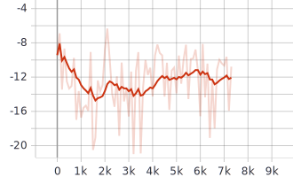
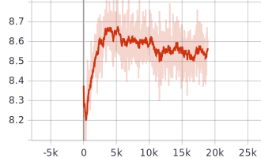
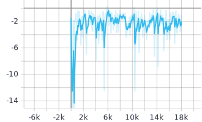
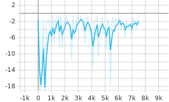
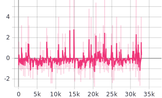

# Rapport TP10 : MADDPG

_Victor Duthoit, Pierre Wan-Fat_

On met en place le modèle MADDPG sur les trois environnements proposés.

## Simple spread

Dans cet environnement, les agents ne semblent apprendre que très peu, ou du moins de manière très lente. Comme on peut le voir dans la figure ci-dessous, l'agent commence d'abord à perdre en nombre quantité de récompenses. 

   
	 
  <figcaption>Fig. 1. Récompenses de l'agent 0 pour les 20000 premières trajectoires</figcaption>

Néanmoins, on note bien une descente du coût TD. L'erreur augmente lors du remplissage du *replay buffer* puis commence à descendre. La recherche d'hyperparamètres par optimisation automatique (avec*Optuna*) n'a pas donné de meilleurs résultats.

   
	 
  <figcaption>Fig. 2. Fonction de coût sur les 2000 premières descentes de gradient</figcaption>

## Simple adversary

On peut voir que l'agent apprend correctement sur cet environnement bien que les agents manquent de stabilité dans leur récompenses à long terme. Il est important de visualiser la récompense totale des agents car elles sont spécifiques par individu dans cet environnement. Par ailleurs, il est intéressant de noter que les récompenses sont plutôt similaires entre l'agent 0 et les deux autres agents 1 et 2 qui sont adversaires. Les récompenses semblent ainsi relativement bien équilibrées pour éviter qu'un des agents prenne le dessus.

   
	 
  <figcaption>Fig. 3. Somme sur les 3 agents des moyennes des rewards sur 100 trajectoires tout les 1000 trajectoires</figcaption>
	 
  <figcaption>Fig. 4. Moyennes des rewards de l'agent 0 sur 100 trajectoires tout les 1000 trajectoires</figcaption>
	 
  <figcaption>Fig. 5. Moyennes des rewards de l'agent 1 sur 100 trajectoires tout les 1000 trajectoires</figcaption>
	 
  <figcaption>Fig. 6. Moyennes des rewards de l'agent 2 sur 100 trajectoires tout les 1000 trajectoires</figcaption>

## Simple tag

L'apprentissage du modèle sur cet environnement n'est pas certain comme l'atteste la figure ci-dessous :

   
	 
  <figcaption>Fig. 7. Somme sur les 3 agents des moyennes des rewards sur 100 trajectoires tout les 1000 trajectoires (30000 première trajectoires)</figcaption>

Par ailleurs, on remarque que les récompenses sont plus faible que pour les autres environnements, cela nécessite un ajustement des pas d'apprentissage.