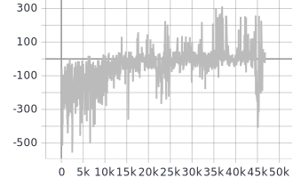
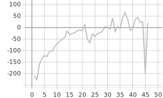
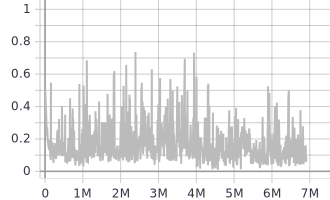
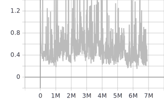

# Rapport TP11: Imitation Learning

## 1. Behavior cloning

On met dans un premier temps en place un agent *Behvior cloning* cherchant à maximiser la probabilité de faire les mêmes actions que l'expert à effectuer pour les états qu'il rencontrait. Les figures ci-dessous montrent qu'un tel agent arrive à apprendre quelque peu. On note qu'il arrive à effectuer des trajectoires à récompenses positives. Néanmoins, il est porbable que ces trajectoires partent d'un état initial proche de l'état initial de la trajectoire experte. Ainsi, il est possible pour l'agent suivre les actions choisies par l'expert. Néanmoins, l'agent ne sait pas quoi faire pour des états qui n'ont pas été rencontrés dans la trajectoire experte. Cet effet s'accentue avec le sur-apprentissage. 

   
	 
  <figcaption>Récompenses par trajectoires effectuée</figcaption>
	
  <figcaption>Récompenses sur moyenne de 100 trajectoires toutes les 1000 trajectoires</figcaption>

## 2. GAIL

Dans cette partie, on a mis en place le modèle d'imitation par méthode adversaire. On utilise les mêmes hyperparamètres que proposés par l'énoncé.

### Résultats

Après environ 20000 événements, l'agent dépasse les rewards positifs. Il atteint aux alentours des 35000 événement des rewards très satisfaisant semblables à l'expert. On note toutefois, une légère instabilité de l'agent qui bien que récupérant rapidement son apprentissage, retombe lors de quelques trajectoires à récompenses négatives. On peut imaginer une diminution de $\epsilon $ (limite du ratio de probabilité) au fur et à mesure de l'apprentissage pour limiter les pas catastrophiques. 

   
	 
  <figcaption>Récompenses par trajectoires effectuée</figcaption>
	
  <figcaption>Récompenses sur moyenne de 100 trajectoires toutes les 1000 trajectoires</figcaption>

### Le discriminant

On peut appercevoir que les score attribués aux données expertes et aux données générées sont relativement bien équilibrées. Les trajectoires expertes sont hautes en restant toutefois à une valeur acceptable (environ 0.9). Il n'y a apparemment pas de sur-apprentissage qui serait néfaste à l'agent. On remarque par ailleur que l'agent est capable de parfois trompé son discriminant en générant des trajectoires proches de l'expert. 

   
	 
  <figcaption>Score sur les données expertes</figcaption>
	
  <figcaption>Score sur les données générées</figcaption>

Cet équilibre se retrouve dans les valeurs prises par la fonction de coût : le discriminant n'apprend pas trop vite, cela permet à l'agent d'avoir des récompenses éparses qui le guident vers les trajectoires expertes petit à petit.

  
  <figcaption>Loss du discriminant</figcaption>

