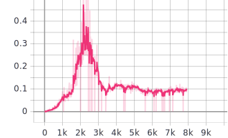
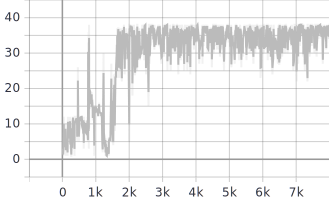

# Rapport TME12 : Implicit Curriculum Learning

## 1. DQN avec goals

Comme proposé, on met en place un agent DQN qui utilise les buts générés par l'environnement. Les rewards présentés ci-dessous montre que l'agent apprend correctement, et très rapidement. 

   
	 
  <figcaption>Fig. 1. Moyenne des rewards sur 100 trajectoires tout les 1000 trajectoires</figcaption>

Le reward à l'epoch 0 est de -10 environ.  L'agent a donc appris beaucoup lors de la première epoch. 

   
	 
  <figcaption>Fig. 2. Évaluation de la fonction de coût lors de l'apprentissage </figcaption>
	 
  <figcaption>Fig. 3 Taux de présence de transaction avec reward de 1 dans le Replay Buffer</figcaption>

On peut voir dans la figures 2 que la descente de gradient ne se produit pourtant qu'après 2000 trajectoires. En effet, il est nécessaire que l'agent récupère suffisamment de transition avec des récompenses de 1 pour les apprendre. De nombreuses tentatives ont échoué car l'agent ne récupérait pas assez de récompenses lors des premières trajectoires. On peut apprécier figure 3 le taux de récompenses égales à 1 dans le Replay Buffer. Il est important de garder ce taux suffisement haut pour que la critique prenne en compte le rewards relativement sparse. 

## 2. Hinsight Experience Replay

L'implémentation du modèle HER fonctionne correctement. Les premiers objectifs atteints arrivent après 2000 trajectoires et le récompenses se densifient peu à peu. Comme le montre les figures ci-dessous. Par ailleurs, l'apprentissage ne semble pas encore stabilisé après 9000 trajectoires. 

   
	 
  <figcaption>Fig. 4. Récompenses lors des 10000 premières trajectoires</figcaption>
	 
  <figcaption>Fig. 5. Récompenses moyenne sur 100 trajectoires toutes les 1000 trajectoires</figcaption>

En visualisant la position final de chaque trajectoire, on peut voir apparaitre des "étages" qui peuvent être représentatifs des "salles" formées dans le **plan2.txt **.On remarque par ailleurs que la plupart des trajectoires après 2000 trajectoires sont relativement proche de l'objectif. Atteindre l'objectif en un temps restreint peut donc être rendu difficile par la part d'action randomisées qui ne diminue pas avec le temps. 

   
	 
  <figcaption>Fig. 6. Évolution de la position final de l'agent (coordonnées x)</figcaption>
	 
  <figcaption>Fig. 7. Évolution de la position final de l'agent (coordonnées y)</figcaption>

## 3. Échantillonnage itératif de buts

La mise en place du modèle Iterative Goal Sampling fonctionne correctement. L'agent apprend rapidement sur  *gridworld3*. On note notamment un rapide apprentissage très important lors des 1000 premières trajectoires. On note en parallèle. 

   
	 
  <figcaption>Fig. 8. Reward sur les 2000 premières trajectoires</figcaption>

On note par ailleurs que la stabilisation des rewards s'opère au même moment que la descente de gradient. En effet, on peut supposer que de nouveaux objectifs sont constamment ajoutés au buffer lors des 800 premières trajectoires mais ensuite, aucun nouvel objectif n'est ajouté, on peut espérer une descente de gradient plus stable.

   
	 
  <figcaption>Fig. 9. Descente de gradient de la fonction de coût (TD)</figcaption>

Finalement, en dessinant les coordonnées du point final occupé par l'agent on remarque une évolution intéressante caractéristique de la topologie de l'environnement :

1. l'agent apprend à se déplacer vers la droite : zone $x = 10$

2. l'agent apprend à descendre : zone $y = 10$

3. l'agent apprend à aller vers la gauche : zone $ x=1$

4. l'agent apprend à remonter : zone $ y=1$

5. L'agent se déplace vers le centre : zone $x=4$

   
	 
  <figcaption>Fig. 10. Évolution de la position final de l'agent (coordonnées x)</figcaption>
	 
  <figcaption>Fig. 11. Évolution de la position final de l'agent (coordonnées y)</figcaption>

Finalement, on note une très grande stabilité dans l'état final qui sera atteint plus ou moins vite. Le paramétrage utilisée a été le suivant :

- $\beta = 0.5$
- $\alpha = 0.1$

