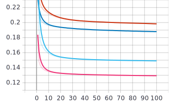
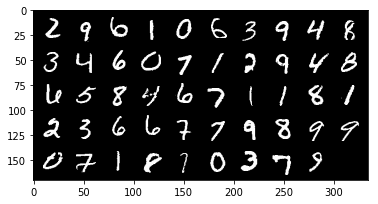
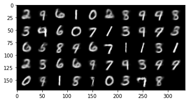
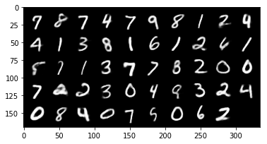
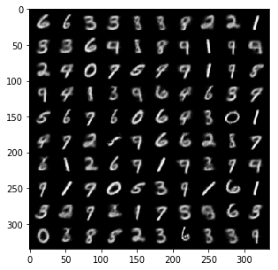
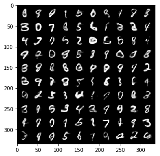
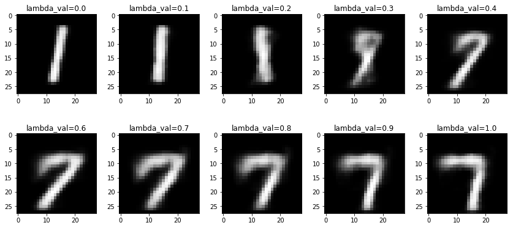
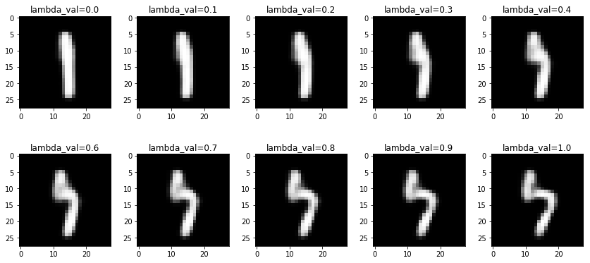
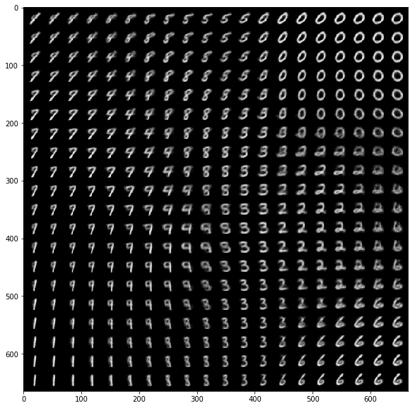

# VAE : Variational Auto-Encoder

_Victor Duthoit, Pierre Wan-Fat_

On implémente dans ce TP un modèle génératif par auto-encodage variationnel. On met en place un modèle linéaire et un convolutif pour étudier les différences produites.

## Entraînement

Les modèles produits apprennent correctement. On peut voir dans la figure ci-dessous la descente de gradient pour :

- un modèle linéaire de dimension latente 2 (rouge)
- un modèle linéaire de dimension latente 10 (cyan)
- un modèle convolutif de dimension latente 2 (bleu)
- un modèle convolutif de dimension latente 10 (rose)

   
	 
  <figcaption>Train loss</figcaption>

Une dimension plus grande permet un meilleur apprentissage du modèle, laissant plus de flexibilité et de détail dans la représentation latente. Par ailleurs, les réseaux convolutifs permettent d'améliorer la proximité avec la distribution latente normale et la reconstruction de l'image de départ.

On se concentrera ainsi sur les réseaux convolutifs offrant un meilleur apprentissage (une fonction de *loss* plus faible en test).

## Évaluation

   
	 
  <figcaption>Images originales</figcaption>
	 
  <figcaption>Reconstitution (convolution, dim 2)</figcaption>
	 
  <figcaption>Reconstitution (convolution, dim 10)</figcaption>

On peut apprécier sur la figure ci-dessus que les réseaux reconstituent correctement les images de la base de données. Par ailleurs, le modèle utilisant une dimension de l'espace latent de 10 est plus précis, plus net. 

Cela se remarque dans les images générées aléatoirement à partir d'une distribution normale sur l'espace latent :

   
	 
  <figcaption>Génération (convolution, dim 2)</figcaption>
	 
  <figcaption>Génération (convolution, dim 10)</figcaption>

Les images sont plus nettes avec un espace plus grand. Néanmoins, elles ne paraissent pas forcément plus vraisemblables. En effet, un plus gros contraste sur le modèle de dimension 10 accentue certains défauts.

Nous avons tenté de mettre en place une interpolation entre deux points de l'espace latent. Ce test permet de vérifier si le *prior* gaussien a bien permis un régularisation de l'espace latent.

   
	 
  <figcaption>Interpolation (convolution, dim 2)</figcaption>
	 
  <figcaption>Interpolation (convolution, dim 10)</figcaption>

Il apparait que l'interpolation du modèle de dimension 2 passe toujours par des données vraisemblables (1, 9, et 7). Cela est moins flagrant pour le modèle de dimension 10 où les chiffres sont plus difficiles à distinguer. 

Finalement, on génère des images depuis une grille de données latentes $[-1.5, 1.5]^2$. On retrouve une continuité dans les données produites. Par ailleurs, il est possible de visualiser l'interpolation produite plus haut. Finalement, le 8 semble jouer un rôle central dans cette distribution. Cela semble compréhensible au vu de sa géométrie calligraphique occupant un grand espace. 

## Conclusion

Pour conclure, on a vu qu'il était possible de faire apprendre une distribution normale à des données par encodage. Si les modèles linéaires apprennent correctement, leurs homologues convolutifs semblent toutefois les surpasser. Le choix de la dimension latente n'est pas évident. Si des modèles à dimension plus élevée permettent une meilleur diminution de l'erreur, on peut apercevoir des aberrations trop contrastées lors de la génération. Un modèle à faible dimension n'offre pas autant de contraste lors de la reconstitution mais cela lui permet de ne pas accentuer ses défauts lors de la génération. 