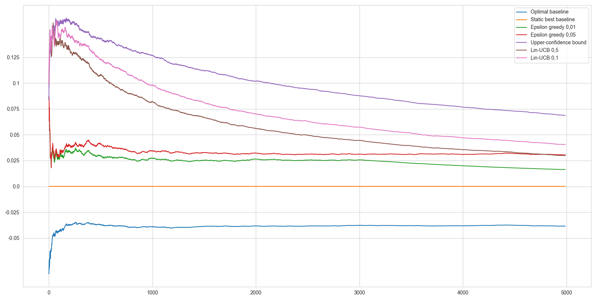

# TME 1 — Problèmes de bandits

_Victor Duthoit, Pierre Wan-Fat_

Dans ce TME, on expérimente plusieurs stratégies afin de résoudre un problème de bandits à plusieurs bras. Voici le regret moyen cumulé :

On constate que l’algorithme UCB a des moins bonnes performances que l’algorithme Lin-UCB, preuve que le contexte est utile dans ce problème. En revanche, la stratégie *epsilon greedy* reste plus efficace que Lin-UCB.