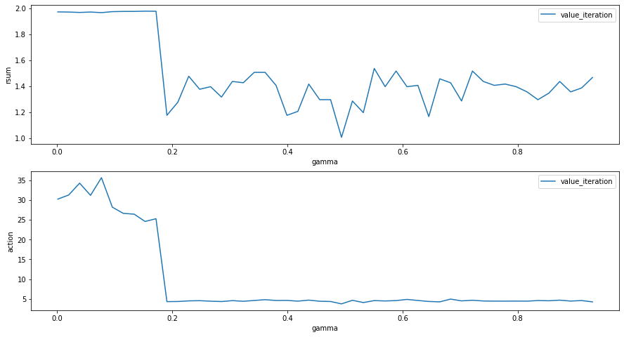
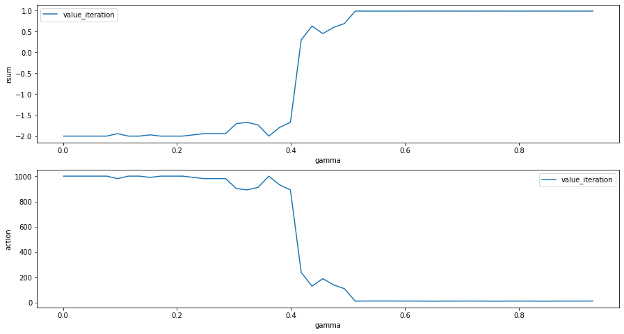

# TME 2 - MPD- Victor Duthoit

## Imports


```python
import gym
import gridworld
import randomAgent
import matplotlib
import matplotlib.pyplot as plt
# matplotlib.use("Qt5agg")
%matplotlib inline
import time
import numpy as np
import operator
import progressbar
import pandas as pd
```

## Utilities


```python
def mse(a,b):
    #return the norm 2 (mean square error) of to functions
    return np.sqrt(sum( (a[x]-b[x])**2 for x in a ))

def dic_argmax(d):
    #return the argmax for dictionnaries
    return max(d.items(), key=operator.itemgetter(1))[0]

pI, vI, rD = 'policy_iteration','value_iteration','random'
```

## Policies algorithms

### 1. Policy iteration


```python
def policyIteration(states, P, eps=0.01, gamma=0.5):
    #return the policy following the policy iteration algorithm
    final_states = set(states)-set(P)
    pi = {s : np.random.randint(4) for s in P } #initialize policy
    #while the policy is unstable
    while True :
        v = {s : 0 for s in states } #initialize the value
        while True : #while value is not stable
            #update of v by the Bellman equation
            v_new = {s : sum( p*(rew + gamma*v[s_p]) for p,s_p,rew,done in P[s][pi[s]]) for s in P }
            for f in final_states:
                v_new[f] = 0
            if mse(v,v_new)<eps:
                v = v_new
                break
            v = v_new
        pi_new = {}
        for s in P:
            #choose the action with the highest value
            pi_action = {a : sum( p*(rew+gamma*v[s_p]) for p,s_p,rew,done in P[s][a] ) for a in P[s]}
            pi_new[s] = dic_argmax(pi_action)
        if mse(pi,pi_new)==0:
            break
        pi = pi_new
    return pi
```

### 2. Value iteration


```python
def valueIteration(states, P, eps=0.01, gamma=0.5):
    #return the policy following the value iteration algorithm
    final_states = set(states)-set(P)
    v = {s : 0 for s in states } #initialize the value
    while True : #while value is not stable
        v_new = {s: max([sum( p*(rew + gamma*v[s_p]) for p,s_p,rew,done in P[s][a]) for a in P[s]]) for s in P }
        for f in final_states:
            v_new[f] = 0
        if mse(v,v_new)<eps:
            v = v_new
            break
        v = v_new
    pi = {s: dic_argmax(
        {a : sum( p*(rew + gamma*v[s_p]) for p,s_p,rew,done in P[s][a]) for a in P[s] }
    ) for s in P }
    return pi        
```

## Agent
Nous définissions des agents qui ont la particularité d'avoir des politiques déterministes à définir.


```python
class Agent(randomAgent.RandomAgent):
    #an agent pocesses a policy pi
    
    def __init__(self, action_space):
        super().__init__(action_space)
        self.pi = dict()
    
    def act(self, observation, reward, done):
        return self.pi[observation]
```

## Environnement - plan0


```python
def createEnv(plan='0', visual=False):
    # matplotlib.use("Qt5agg")
    env = gym.make("gridworld-v0")
    env.setPlan(f"gridworldPlans/plan{plan}.txt", {0: -0.001, 3: 1, 4: 1, 5: -1, 6: -1})
    states, P = env.getMDP()
    env.seed(0)  # Initialise le seed du pseudo-random
    # print(env.action_space)  # Quelles sont les actions possibles
    # print(env.step(1))  # faire action 1 et retourne l'observation, le reward, et un done un booleen (jeu fini ou pas)
    env.render()  # permet de visualiser la grille du jeu 
#     env.render(mode="human") #visualisation sur la console
    statedic, mdp = env.getMDP()  # recupere le mdp : statedic
#     print("Nombre d'etats : ",len(statedic))  # nombre d'etats ,statedic : etat-> numero de l'etat
    state, transitions = list(mdp.items())[0]
    return env
    # print(state)  # un etat du mdp
    # print(transitions)  # dictionnaire des transitions pour l'etat :  {action-> [proba,etat,reward,done]}

createEnv()
```


    <gridworld.gridworld_env.GridworldEnv at 0x1a30578828>

## Test agent
On définit deux fonctions de test. L'une pour tester un agent dans un environnement connu, l'autre pour tester tous les paramètres en entrée.


```python
def testAgent(agent, env, episode_count=1, visual=False, freq=100, FPS=0.01):
    #test an agent for a given environment
    if visual:
        matplotlib.use('Qt5Agg')
    reward = 0
    done = False
    rsum = 0
    R = 0
    actions = 0
    for i in range(episode_count):
        obs = env.reset()
        if visual:
            print(obs)
        env.verbose = (i % freq == 0 and i > 0)  # afficher 1 episode sur 100
        if env.verbose and visual:
            env.render(FPS)
        j = 0
        rsum = 0
        while True:
            action = agent.act(gridworld.GridworldEnv.state2str(obs), reward, done)
            obs, reward, done, _ = env.step(action)
            rsum += reward
            j += 1
            if env.verbose and visual:
                env.render(FPS)
            if done:
                if visual:
                    print("Episode : " + str(i) + " rsum=" + str(rsum) + ", " + str(j) + " actions")
                R+= rsum
                actions+= j
                break
    avg_rsum = R/episode_count
    avg_action = actions/episode_count
    env.close()
    if visual :
        %matplotlib inline
    return [avg_rsum, avg_action]
```


```python
def testSeries(plan = ['0'],
               agents = [pI,vI,rD], 
               epsilon = [0.1],
               gamma = [0.1], 
               episode_count = [100]):
    #tests all the agents for given parameters
    res = []
    N = len(plan)*len(agents)*len(epsilon)*len(gamma)*len(episode_count)
    i=0

    bar = progressbar.ProgressBar(maxval=N, \
    widgets=[progressbar.Bar('=', '[', ']'), ' ', progressbar.Percentage()])
    bar.start()
    for p in plan:
        env = gym.make("gridworld-v0")
        env.setPlan(f"gridworldPlans/plan{p}.txt", {0: -0.001, 3: 1, 4: 1, 5: -1, 6: -1})
        states, P = env.getMDP()
        agent = Agent(env.action_space)
        for eps in epsilon:
            for g in gamma:
                for ec in episode_count:
                    for ag in agents:
                        if ag==rD:
                            agent = randomAgent.RandomAgent(env.action_space)
                            t_pi = 0.
                        else:
                            t1_pi = time.time()
                            if ag==pI:
                                policy = policyIteration(states, P, eps=eps, gamma=g)
                            if ag==vI:
                                policy = valueIteration(states, P, eps=eps, gamma=g)
                            t_pi = time.time()-t1_pi
                            agent.pi = policy
                        t1_test = time.time()
                        test = testAgent(agent,env, episode_count = ec)
                        t_test = time.time()-t1_test
                        res.append([p,eps,g,ec,ag]+test+[t_pi,t_test])
                        i+=1
                        bar.update(i)
    bar.finish()
    columns = ['plan','eps','gamma','episode_count','agent','rsum','action','t_pi','t_test']
    return pd.DataFrame(res,columns=columns)
```


```python
def plotSeries(df, xaxis='gamma',yaxis='rsum',legend='agent',legendValue=[pI,vI],bar=False):  
    plot = ()
    for legendV in legendValue:
        subdf = df[df[legend]==legendV]
        x = subdf[xaxis].to_numpy()
        y = subdf[yaxis].to_numpy()
        plot+=(x,y)
    if bar:
        plt.bar(*plot)
    else:
        plt.plot(*plot)
    plt.ylabel(yaxis)
    plt.xlabel(xaxis)
    plt.legend(legendValue)
```


```python
# Execution avec un Agent

# agent = randomAgent.RandomAgent(env.action_space)
eps = 0.1
gamma = 0.1
policy = policyIteration(states, P, eps=eps, gamma=gamma)
# policy = valueIteration(states, P,eps=eps, gamma=gamma)
agent = Agent(env.action_space)
agent.pi = policy
testAgent(agent, env)
```


    [0.979, 22.0]


### Premier tests

Test for plan0, seed(0), 10000 episode, esp = 0.0001, gamma = 0.9 :
- __policy iteration agent:__ average rsum : 0.56, average action : 4.79
- __value iteration:__ average rsum : 0.55, average number of action : 4.80
- __random agent:__ average rsum : -0.81, average action : 11.33

Les agents "politisés" sont bien meilleurs.

## Choix d'epsilon


```python
epsilon = np.linspace(0.01,1,num=50)
df_eps = testSeries(epsilon=epsilon,agents=[pI,vI]
```

```python
#plots
plt.figure(figsize=(15,12))
plt.subplot(311)
plotSeries(df_eps, xaxis='eps', yaxis='rsum')
plt.subplot(312)
plotSeries(df_eps, xaxis='eps', yaxis='action')
plt.subplot(313)
plotSeries(df_eps, xaxis='eps', yaxis='t_pi') #t_pi is the time to determine the policy
```


On remarque qu'un epsilon relativement élevé est suffisant pour une bonne détermination de la politique. On choisira ainsi un eps = 0.1 pour la suite des calculs. On remarque de plus que l'itération de la politique est plus longue à déterminer.

## Rôle de gamma


```python
gamma = np.linspace(0.001,0.93,num=100)
df_gamma = testSeries(gamma=gamma,agents=[pI,vI])
```

    [=                                                                       ]   2%
    
    0


    [========================================================================] 100%


```python
#plots
plt.figure(figsize=(15,10))
plt.subplot(211)
plotSeries(df_gamma, xaxis='gamma', yaxis='rsum')
plt.subplot(212)
plotSeries(df_gamma, xaxis='gamma', yaxis='action')
```


On peut noter deux points importants :
1. Les deux algorithmes semblent procurer des résultats similaires. On pourra ainsi se contenter de l'algorithme d'itération de la valeur. 
2. Gamma joue un rôle essentiel dans le choix des stratégies de jeux. Apparemment, un gamma élevé privilégiera des gains accessibles rapidement, la partie s'écourtera ainsi plus rapidement. En revanche un gamma moindre a tendance à ne pas trop dévaloriser les gains accessibles en plus de coûts. Les paliers incitent à croire qu'un gain est possible en effectuant plus d'actions. Ainsi, cela donne à penser que le gamma dépend de la topologie du terrain.
3. L'optimal de reward est atteint pour des valeurs proches de 0 ou de 1. On retiendra la valeur 0.1 pour gamma (proche de 0) car le palier proche de 1 semble limité.

# Gestion du temps


```python
#plots
plt.figure(figsize=(15,10))
plt.subplot(211)
plotSeries(df_gamma, xaxis='gamma', yaxis='t_pi')
plt.subplot(212)
plotSeries(df_gamma, xaxis='gamma', yaxis='t_test')
```


1. La première observation que l'on peut faire est que l'ordre de grandeur de calcul de la politique est très faible devant les temps de tests.
2. De plus, on remarque que l'algorithme d'itération de la valeur est plus rapide à terminer que son homologue d'itération de la politique. 
3. Les temps de tests sont similaires pour les deux algos et ressemblent grossièrement à la distribution du nombre d'actions. 

## Sur de nouveaux terrains


```python
gamma = np.linspace(0.001,0.93,num=50)
plan = list(range(9))
df_plan = testSeries(plan=plan, gamma=gamma,agents=[vI])
```

```python
#plots
plt.figure(figsize=(15,10))
plt.subplot(211)
plotSeries(df_plan, xaxis='gamma', yaxis='rsum', legend='plan', legendValue=plan)
plt.subplot(212)
plotSeries(df_plan, xaxis='gamma', yaxis='action', legend='plan', legendValue=plan)
```


On remarque que les plans n'ont pas les mêmes ordres de grandeur concernant le nombre d'actions et les gains. Néanmoins, nous pouvons voir que le dépendance en fonction de gamma changent avec les plans. Voyons de plus près.


```python
def plotPlan(df,p):
    sub_df = df[df['plan'] == p]
    plt.figure(figsize=(15,8))
    plt.subplot(211)
    plotSeries(sub_df, xaxis='gamma', yaxis='rsum', legendValue=[vI])
    plt.subplot(212)
    plotSeries(sub_df, xaxis='gamma', yaxis='action', legendValue=[vI])
```

# Plan 0


```python
plotPlan(df_plan,0)
createEnv(0)
```


# Plan 1


```python
plotPlan(df_plan,1)
createEnv(1)
```





# Plan 2


```python
plotPlan(df_plan,2)
createEnv(2)
```


# Plan 3


```python
plotPlan(df_plan,3)
createEnv(3)
```


# Plan 4


```python
plotPlan(df_plan,4)
createEnv(4)
```


# Plan 5


```python
plotPlan(df_plan,5)
createEnv(5)
```


# Plan 6


```python
plotPlan(df_plan,6)
createEnv(6)
```





# Plan 7


```python
plotPlan(df_plan,7)
createEnv(7)
```


# Plan 8


```python
plotPlan(df_plan,8)
createEnv(8)
```


```python
createEnv(10)
```


