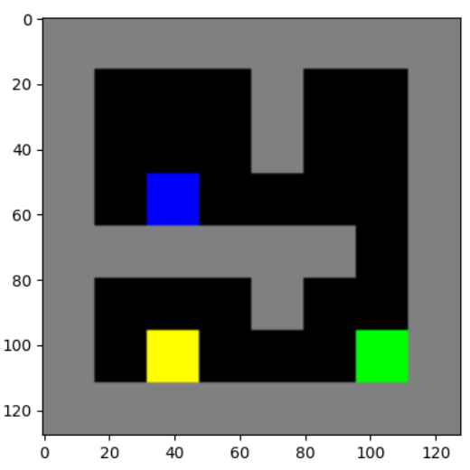
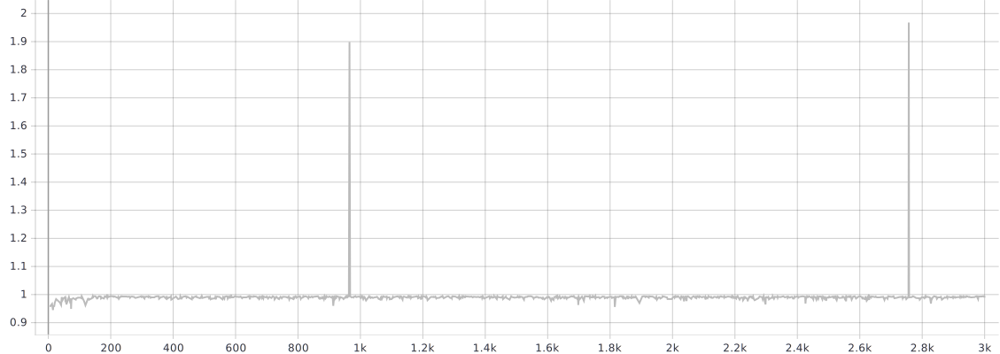
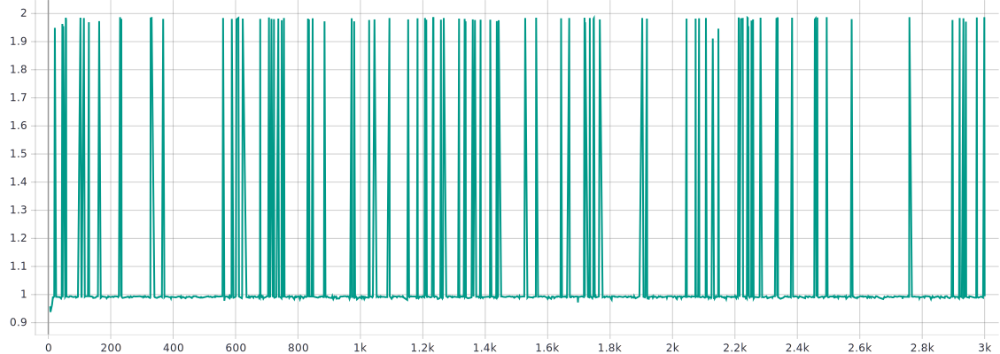
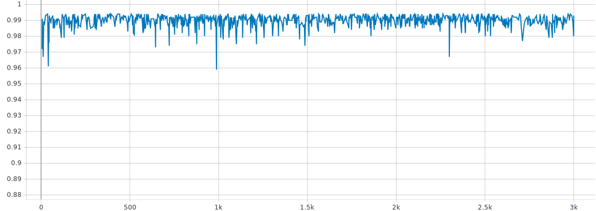
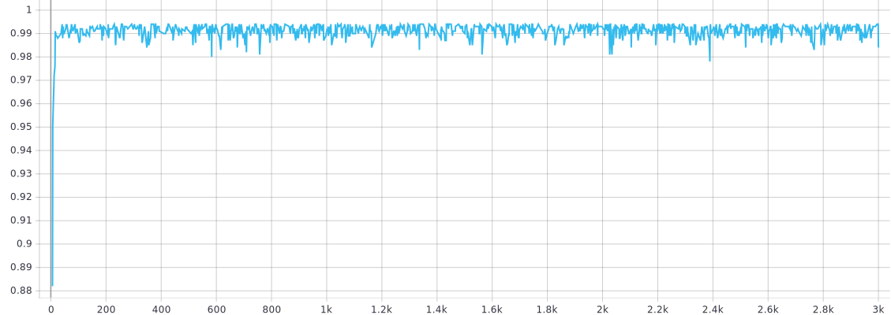
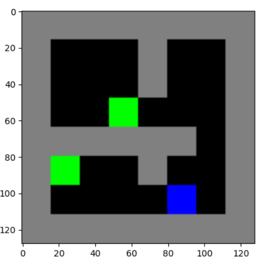
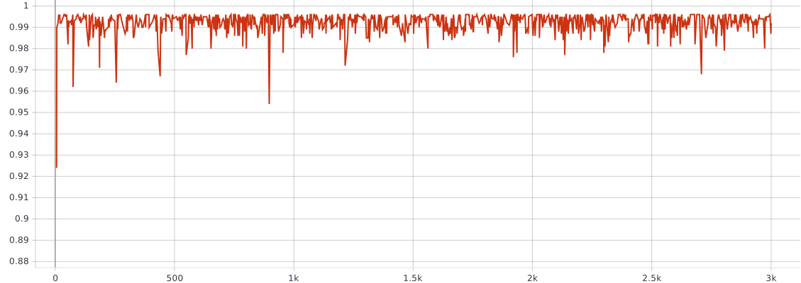
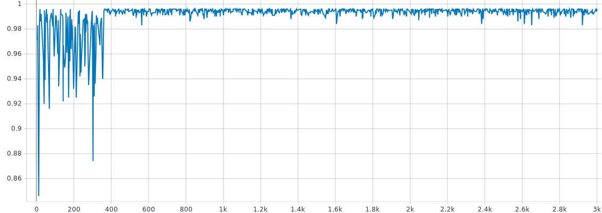
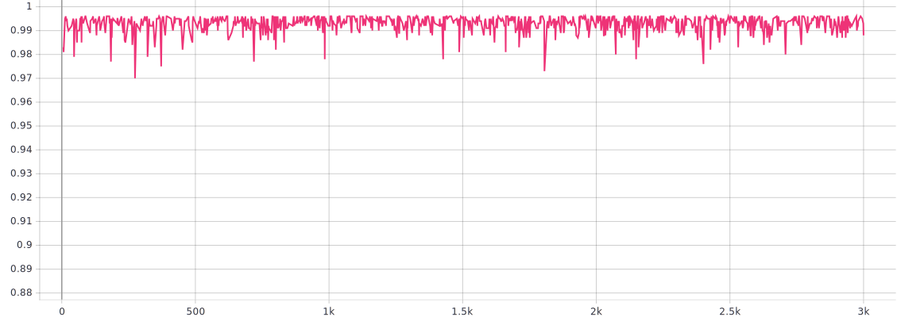

# TME 3 — Q-Learning

_Victor Duthoit, Pierre Wan-Fat_

Dans ce TME, on utilise l’environnement GridWorld. Les cartes 2 et 3 ont été utilisées, les cartes précédentes étant trop simples et la carte 4 étant déjà trop grosse pour que l’entraînement se finisse en un temps raisonnable. Les courbes présentées représentent 3 000 épisodes.

On a implémenté les algorithmes Q-Learning et SARSA, avec deux types d’exploration (*epsilon greedy* et *epsilon greedy decay*).

## Hyperparamètres

Ces hyperparamètres sont utilisés pour les deux environnements.

```python
# Q-Learning.
	alpha = 0.1
	gamma = 0.99

# epsilon greedy.
	epsilon = 0.1

# epsilon greedy decay (epsilon = epsilon_0 * alpha / global_step)
    epsilon_0 = 0.1
    alpha = 1000
```

## Plan 2



On remarque la présence d’un bloc jaune qui récompense beaucoup, mais qui est placé après le bloc vert (terminal) sur le chemin naturel de l’agent.

### Q-Learning

Avec une exploration *epsilon greedy*, on voit que l’apprentissage se fait très rapidement (convergence après 200 épisodes) mais l’agent ne parvient presque jamais à aller prendre le bloc jaune.



L’exploration *epsilon greedy decay* améliore les performances de l’agent, qui parvient à récupérer la récompense additionnelle beaucoup plus souvent.



### SARSA

SARSA ne parvient en revanche jamais à atteindre la récompense additionnelle, que ce soit avec la stratégie *epsilon greedy* classique ·



Ou avec la stratégie *epsilon greedy decay*. On remarque cependant que les performances oscillent moins.



## Plan 3



Deux blocs verts sont présents, l’un étant légèrement plus accessible que l’autre.

### Q-Learning

Avec une exploration *epsilon greedy*, l’apprentissage se fait rapidement, et les oscillations sont assez modérées.



L’exploration *epsilon greedy decay* améliore les performances de l’agent après convergence, même si l’apprentissage prend plus de temps.



### SARSA

SARSA a des bonnes performances et une convergence rapide :



La stratégie *epsilon greedy decay* prend un peu plus de temps mais oscille moins après convergence :

