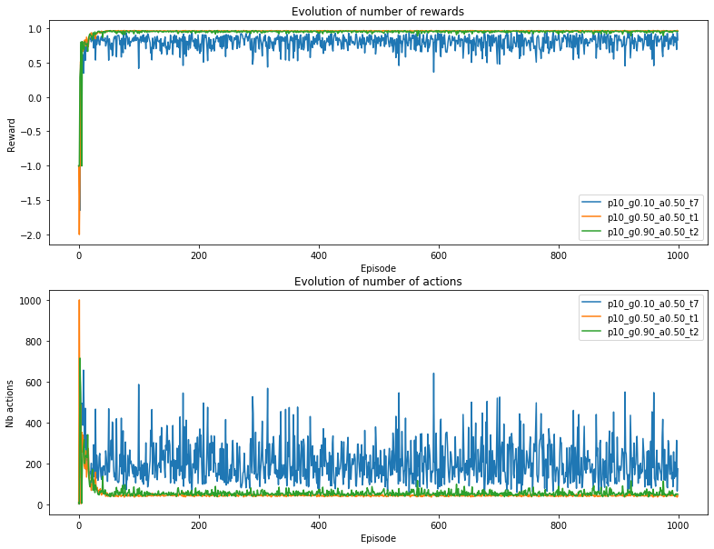

# TME 3 — Q-Learning

_Victor Duthoit, Pierre Wan-Fat_

Dans ce TME, on utilise l’environnement GridWorld.

## Q-Learning

### Plans 0 à 3

0. Comme prévu, l’agent apprend très vite sur ce plan.
1. L’agent apprend tout aussi.
2. L’agent se trouve bloqué dans un minimum local pour le plan 2, même s’il est passé au moins une fois dans une trajectoire qui lui a donné la récompense additionnelle.
3. L’agent apprend correctement sur un terrain avec deux états terminaux.

### Plans 4 à 6

4. Accéder à l’état terminal nécessite de prendre un malus. L'agent ne semble pas réussir à apprendre cela. Comme pour le plan 2, on note que ce n’est pas parce que la trajectoire optimale a été suivie une fois qu’elle sera suivie par la suite : un apprentissage de plus de 1000 épisodes semble nécessaire.
5. L'agent est bloqué dans un minimum local. Il ne considère pas la récompense qui se trouve loin d’être aléatoirement atteignable. 
6. La conclusion tirée pour le plan 5 est aussi valable pour le plan 6.

### Plans 7 à 10

7. Le plan 7 est une version plus difficile du plan 4. L'agent arrive seulement à récupérer les récompenses proches, sans pouvoir atteindre l’état final.
8. Le plan 8 est relativement grand, l'agent prend beaucoup de temps à explorer souvent sans atteindre l'état final. Néanmoins, il atteint plusieurs fois l’état final.
9. Dans ce plan, l'agent trouve une solution sous-optimale : il prend les récompenses mais reste coincé dans la zone de départ. On peut émettre l'hypothèse que les états finaux à récompenses négatives "découragent" l'agent de s'approcher de la porte. 
10. Le plan 10 est relativement facile et son apprentissage est relativement stable.

### Rôle de γ et α

On effectue les tests sur le plan 1.

L’apprentissage est plus rapide pour des $\alpha$ élevés ; plus précisément, un $\alpha$ trop faible rend l’apprentissage plus lent et moins stable.

Les conclusions similaires pour l’effet de $\gamma$ : une valeur trop faible donne un apprentissage instable (l’agent "doute").

### Durée de l’apprentissage

On tente d’augmenter le temps d’apprentissage sur les environnements difficiles.

Le nombre d’épisodes permet avant tout de limiter le nombre d’actions, la trajectoire est plus directe mais pas optimale.

## SARSA

On couple l’algorithme SARSA avec une stratégie *epsilon-greedy* qui devient 0 (exploitation pure) après 500 épisodes. Sur le plan 2 :

Il semble qu'une exploration de type "full random" puis "full determinist" ne donne pas de résultats très bons. L'agent explore bien le plan avant l'épisode 7000. Il semblerait qu'il ait appris puisque qu'il réempruntera de nombreuses fois la trajectoire optimale. Néanmoins, il semblerait qu'il change sa stratégie autour de l'épisode 8500 pour prendre uniquement la trajectoire la plus directe. On peut émettre l'hypothèse que la récompense jaune n'est pas forcément évidente à atteindre même en connaissant la trajectoire car l'agent passe par deux fois à côté de l'état final. Ainsi, l'effet non déterministe des mouvements (MDP) va faire arrêter l'agent à plusieurs reprises sur l'état final. Un potentiel phénomène d'apprentissage va augmenter la qualité de la trajectoire menant directement à l'état final. En effet, quand l'agent est placé sur certaines cases, il faut :

- dans le cas où la récompense jaune a déjà été atteinte, se tourner vers la sortie 
- dans le cas où la récompense jaune n'a pas encore été ramassée, se tourner vers la case jaune. 
  Une temporalité/directionnalité est ainsi à mettre en place pour permettre de surpasser cet obstacle. 

