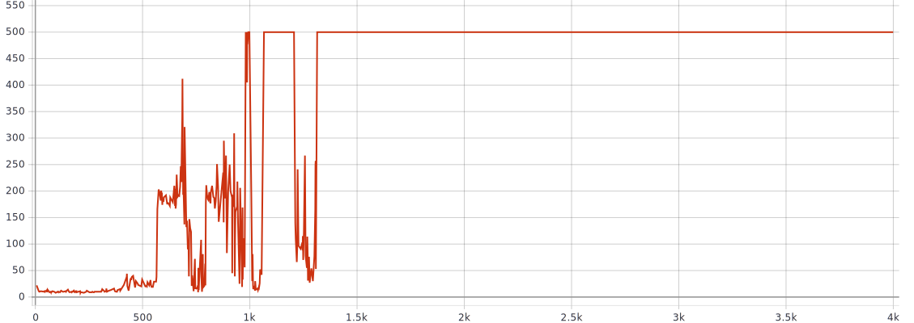
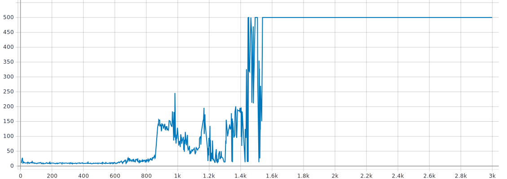
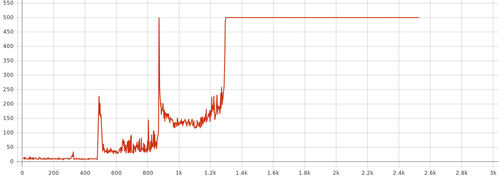
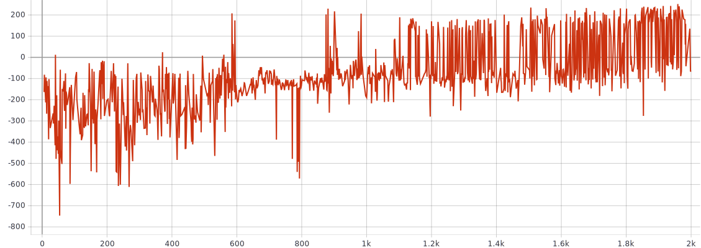
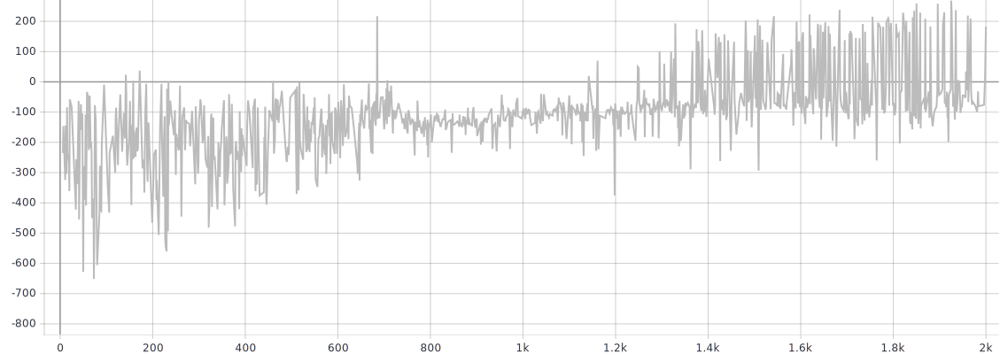

# TME 4 — DQN

_Victor Duthoit, Pierre Wan-Fat_

Nous avons implémenté trois algorithmes, DQN, Prioritized DQN et Dueling DQN. Pour tous ces algorithmes, les techniques d’Experience Replay et de Target Network ont été utilisées. Comme conseillé, afin d’entraîner le réseau Q, nous avons utilisé la fonction de coût Huber.

## Cartpole

### DQN

```python
"memory_size": 3000,  # Size of the Experience Replay buffer.
"batch_size": 32,
"epsilon_0": 0.005,  # epsilon = 1 / (epsilon_0 * t).
"gamma": 0.99,
"lr": 0.05,
"q_layers": [24, 24],
"sync_frequency": 500,  # For Target Network: swap the network every `sync_frequency` steps.
```



### Prioritized DQN

```python
"memory_size": 3000,
"batch_size": 32,
"epsilon_0": 0.005,
"gamma": 0.99,
"lr": 0.05,
"q_layers": [24, 24],
"memory_alpha": 0.5,
"memory_beta": 0.5,
"sync_frequency": 500,
```



### Dueling DQN

```python
"memory_size": 3000,
"batch_size": 32,
"epsilon_0": 0.005,
"gamma": 0.99,
"lr": 0.05,
"advantage_layers": [24],
"value_layers": [24],
"memory_alpha": 0.5,
"sync_frequency": 500,
```




Globalement, les trois algorithmes parviennent à apprendre l’environnement et obtenir le score maximal au bout de quelques centaines d’épisodes. L’algorithme DQN est le plus rapide, bien que l’entraînement soit un peu chaotique au début. Dueling DQN a une courbe un peu plus lisse, mais il apprend un peu moins vite. Enfin, Prioritized DQN a les moins bonnes performances.

## LunarLander

### DQN

Afin de trouver de bons hyperparamètres, on procède par recherche par grille.

```python
memory_size in (3000, 10000)
epsilon_0 in (0.0001, 0.001, 0.01, 0.1, 1)
gamma in (0.98, 0.99, 0.999)
lr in (1e-7, 1e-6, 1e-5, 1e-3)
sync_frequency in (1000, 5000)
```

Presque aucun modèle n’a de performances satisfaisantes. On obtient cependant des performances acceptables pour le jeu d’hyper-paramètres suivant :

```python
"memory_size": 3000
"batch_size": 64
"epsilon_0": 0.0001
"gamma": 0.99
"lr": 0.001
"sync_frequency": 1000
```



Ou bien avec :

```
"memory_size": 3000
"batch_size": 64
"epsilon_0": 0.0001
"gamma": 0.99
"lr": 0.001
"sync_frequency": 5000
```



On constate tout de même une très forte variance entre les essais, même à la fin de l’entraînement, lorsqu’il n’y a plus d’exploration.