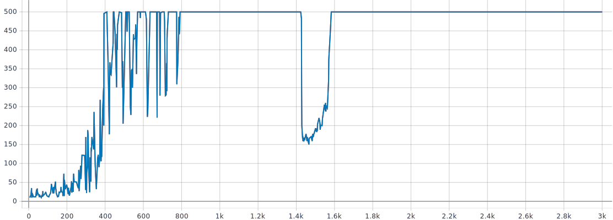
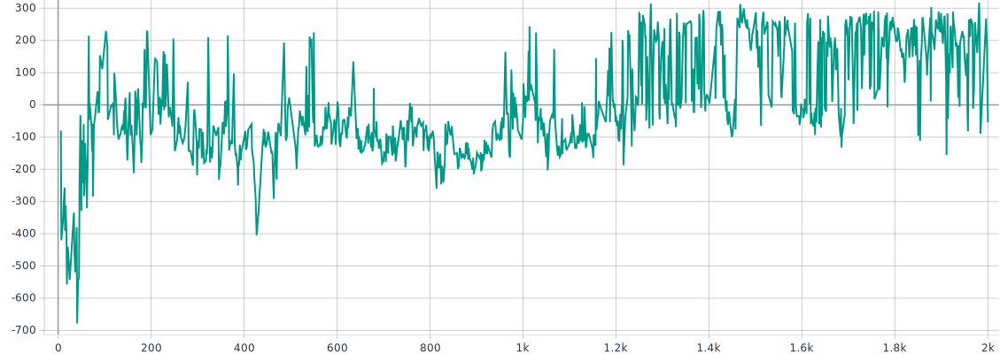

# TME 5 — Policy Gradients

_Victor Duthoit, Pierre Wan-Fat_

On a implémenté l’algorithme Actor-Critic en version TD(0).

## CartPole

Les réseaux de politique et de value partagent la même première couche, à laquelle ils ajoutent chacun une couche cachée (256 neurones dans chaque couche). On utilise par ailleurs un optimiseur Adam.

```python
"learning_rate": 0.0002,
"gamma": 0.98,
```



On voit que le réseau Actor-Critic a de très bonnes performances sur CartPole.

## LunarLander

Afin de trouver de bons hyperparamètres, on procède par recherche par grille.

```python
learning_rate in (0.0001, 0.001, 0.01, 0.1, 1)
gamma in (0.98, 0.99, 0.999)
```

Presque aucun modèle n’a de performances satisfaisantes. On obtient cependant des performances acceptables pour le jeu d’hyper-paramètres suivant :

```python
"learning_rate": 0.001
"gamma": 0.98
```



On constate tout de même une très forte variance entre les essais, même à la fin de l’entraînement, lorsqu’il n’y a plus d’exploration.