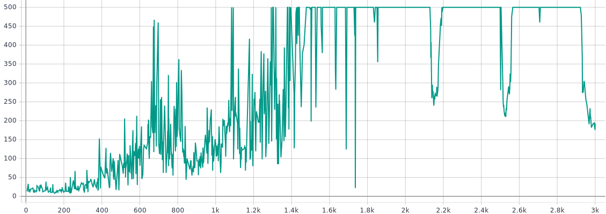
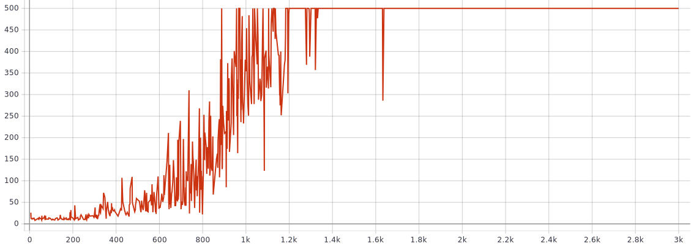
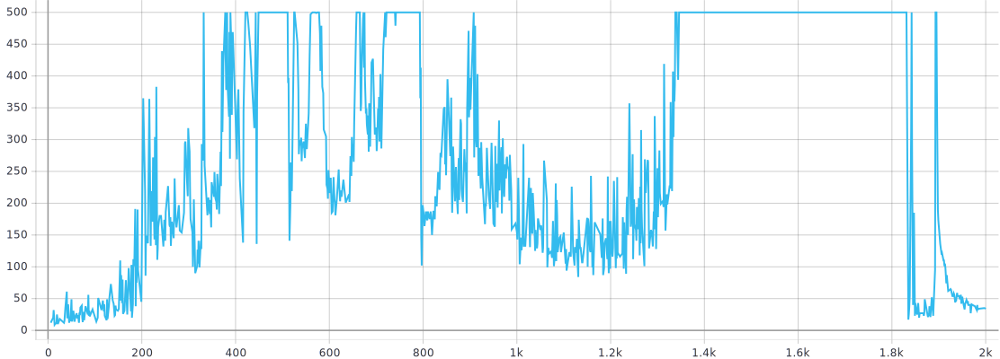
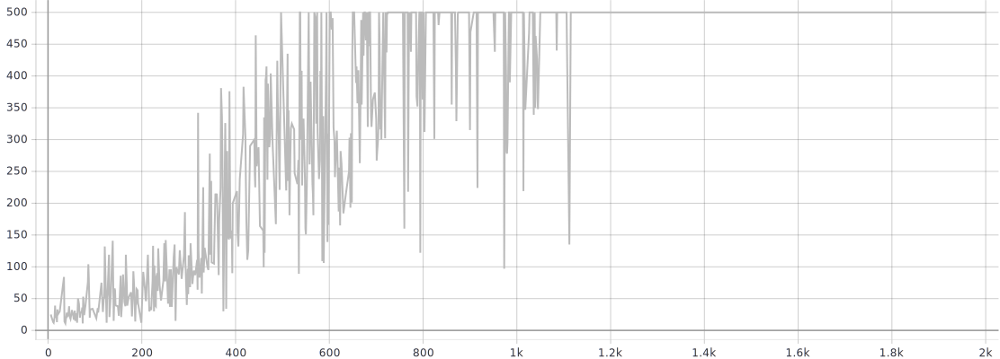
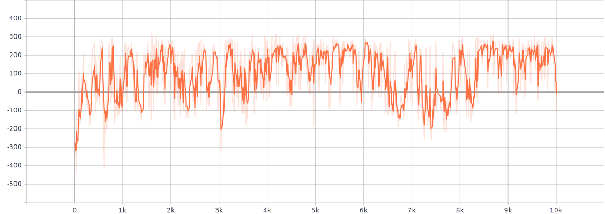
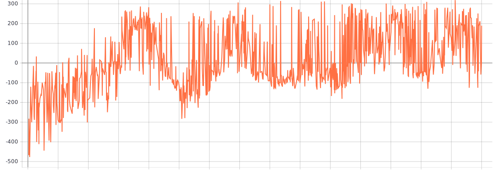

# TME 6 — Advanced Policy Gradients

_Victor Duthoit, Pierre Wan-Fat_

On a implémenté les deux versions de PPO (Adaptive KL et Clipped Objective).

Les réseaux de politique et de value partagent la même première couche, à laquelle ils ajoutent chacun une couche cachée (256 neurones dans chaque couche). On utilise par ailleurs un optimiseur Adam.

## CartPole

### PPO Adaptive KL

Afin de trouver de bons hyperparamètres, on procède par recherche par grille.

```python
learning_rate in (0.0001, 0.001, 0.01)
gamma in (0.98, 0.99, 0.999)
delta in (1e-3, 1e-2, 5e-2)
k in (2, 3, 4)
```

Sur un environnement aussi simple, l’algorithme arrive souvent à atteindre des épisodes à 500 itérations, mais très souvent, il décroche et oublie ce qu’il a appris, comme par exemple :



On trouve néanmoins des entraînements plus stables, comme celui-ci :

```python
"learning_rate": 0.0001,
"gamma": 0.98,
"delta": 0.001,
"k": 3,
```



### PPO Clipped

Afin de trouver de bons hyperparamètres, on procède par recherche par grille.

```python
learning_rate in (0.0001, 0.001, 0.01)
gamma in (0.98, 0.99, 0.999)
epsilon in (1e-3, 1e-2)
k in (2, 3, 4)
```

Globalement, cette version de PPO arrive encore plus que la précédente à atteindre les 500 itérations. Cependant, il est plus rare que l’agent parvienne à maintenir cette performance, et de nombreux agents connaissent du *catastrophic forgetting* :



On trouve néanmoins des entraînements plus stables, comme celui-ci :

```python
"learning_rate": 0.0001,
"gamma": 0.98,
"epsilon": 0.01,
"k": 4,
```



## LunarLander

### PPO Adaptive KL

Après recherche par grille, on trouve les hyperparamètres suivants :

```python
"learning_rate": 0.001
"gamma": 0.98
"k": 2
"delta": 0.01
```



### PPO Clipped

Après recherche par grille, on trouve les hyperparamètres suivants :

```python
"learning_rate": 0.0001
"gamma": 0.98
"k": 4
"epsilon": 0.01
```




On constate que l’algorithme a des récompenses globalement positives, ce qui indique qu’il a réussi la tâche, même s’il y a une fort variance dans les résultats, avec des passages où les récompenses deviennent complètement négatives.