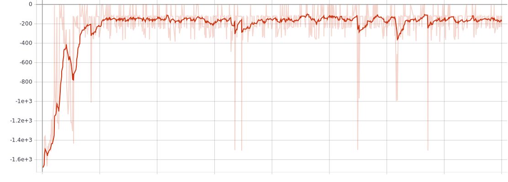
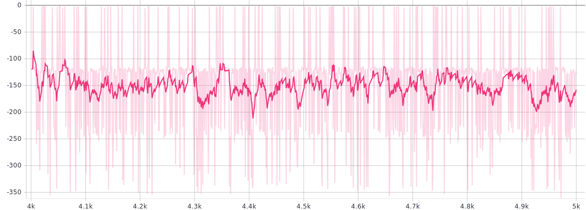
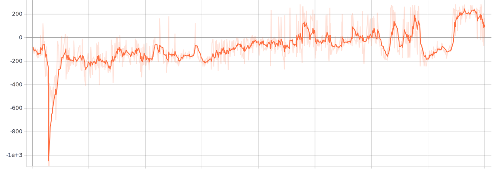
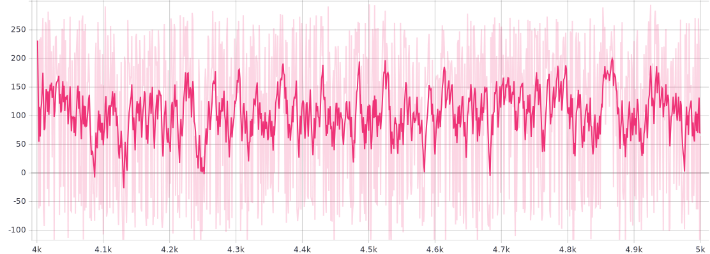
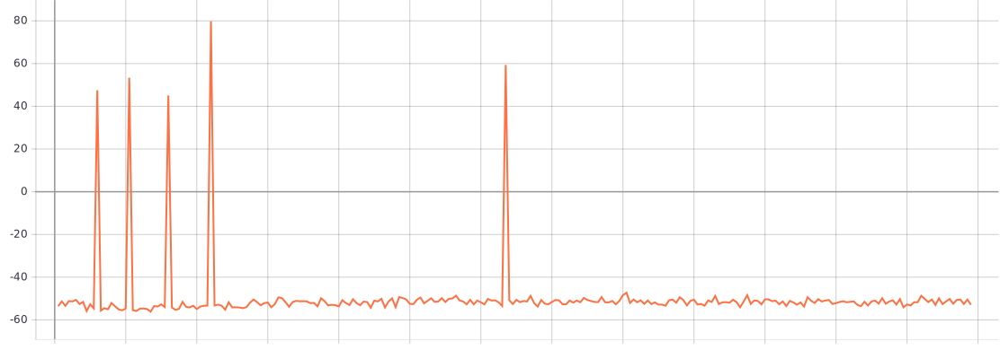
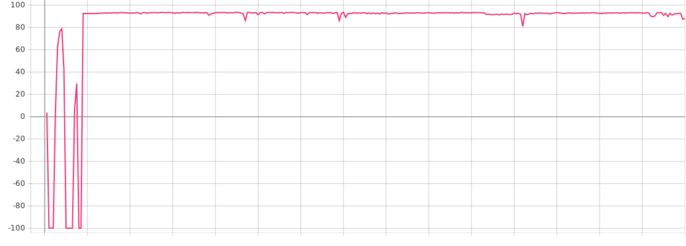

# TME 7 — Continuous Actions

_Victor Duthoit, Pierre Wan-Fat_

On a implémenté l’algorithme DDPG.

## Pendulum

Afin de trouver de bons hyperparamètres, on procède par recherche par grille.

```python
number_of_updates in (3, 5)
policy_learning_rate in (1e-4, 1e-3, 1e-2)
q_learning_rate in (1e-4, 1e-3, 1e-2)
noise_sigma in (0.05, 0.1)
gamma in (0.98, 0.99)
rho in (0.99, 0.995)
```

On trouve les hyperparamètres suivants :

```python
"number_of_updates": 5,
"policy_learning_rate": 0.001,
"q_learning_rate": 0.01,
"noise_sigma": 0.1,
"memory_max_size": 10000,
"batch_size": 1024,
"gamma": 0.99,
"rho": 0.99,
```

Les 4 000 premiers épisodes sont des épisodes d’entraînement :



Puis, on évalue l’agent sur 1 000 épisodes supplémentaires, où on désactive l’exploration :



On voit que l’agent parvient assez souvent à récupérer une récompense maximale (0 ou proche de 0) ; les récompenses oscillent globalement entre -350 et 0.

## LunarLanderContinuous

Afin de trouver de bons hyperparamètres, on procède par recherche par grille.

```python
number_of_updates in (3, 5)
policy_learning_rate in (1e-4, 1e-3, 1e-2)
q_learning_rate in (1e-4, 1e-3, 1e-2)
noise_sigma in (0.05, 0.1)
gamma in (0.98, 0.99)
rho in (0.99, 0.995)
```

On trouve les hyperparamètres suivants :

```python
"number_of_updates": 3,
"policy_learning_rate": 0.0001,
"q_learning_rate": 0.001,
"noise_sigma": 0.1,
"memory_max_size": 10000,
"batch_size": 1024,
"gamma": 0.99,
"rho": 0.995,
```

Les 4 000 premiers épisodes sont des épisodes d’entraînement :



Puis, on évalue l’agent sur 1 000 épisodes supplémentaires, où on désactive l’exploration :



On voit que l’agent parvient assez souvent à récupérer des récompenses positives, même s’il continue, une fois sur cinq, à avoir des récompenses négatives.

## MountainCarContinuous

Pour ce problème, une bonne exploration est cruciale. En effet, l’agent perd des points à chaque fois qu’il bouge ; s’il ne comprend pas très vite qu’une récompense l’attend à l’extrême droite du terrain, il va se laisser enfermer dans un minimum local fait de très petites oscillations autour de sa position de départ. Ainsi, dans cet exemple, même si l’agent atteint la récompense ponctuellement, il n’explore plus du tout au bout de quelques itérations :



Nous avons donc changé la stratégie d’exploration par rapport aux problèmes précédents, en prenant un `noise_sigma` de 0,5 (5 fois plus que précédemment) et en introduisant un *decay* sur le bruit.

```python
"number_of_updates": 3,
"policy_learning_rate": 0.01,
"q_learning_rate": 0.001,
"noise_sigma": 0.5,
"memory_max_size": 10000,
"batch_size": 256,
"gamma": 0.99,
"rho": 0.999,
```



L’agent parvient donc à apprendre le mouvement à réaliser et à s’y maintenir.