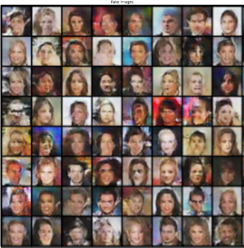

# TME 8 — Generative Adversarial Networks

_Victor Duthoit, Pierre Wan-Fat_

Le but de ce TP est de générer des visages de célébrités grâce à des réseaux adverses (GAN). Pour cela, on utilise une architecture DCGAN.

Voici les résultats obtenus après une centaine d’époques :

Comme on le voit, les visages ressemblent effectivement à des visages humains, bien que certains détails ne soient pas parfaits. De plus, les visages sont relativement variés : on ne voit pas deux fois le même visage, et il y a un certaine variation de l’arrière-plan, des couleurs de cheveux, des poses…